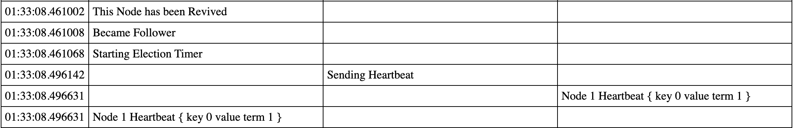
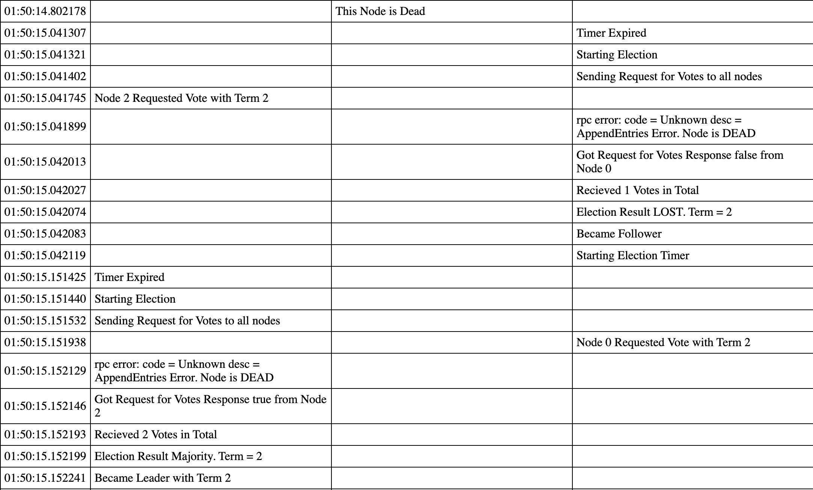
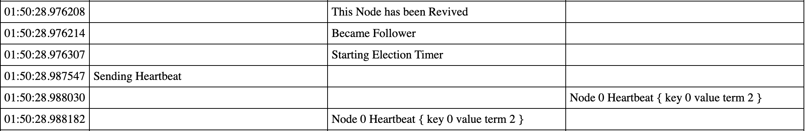
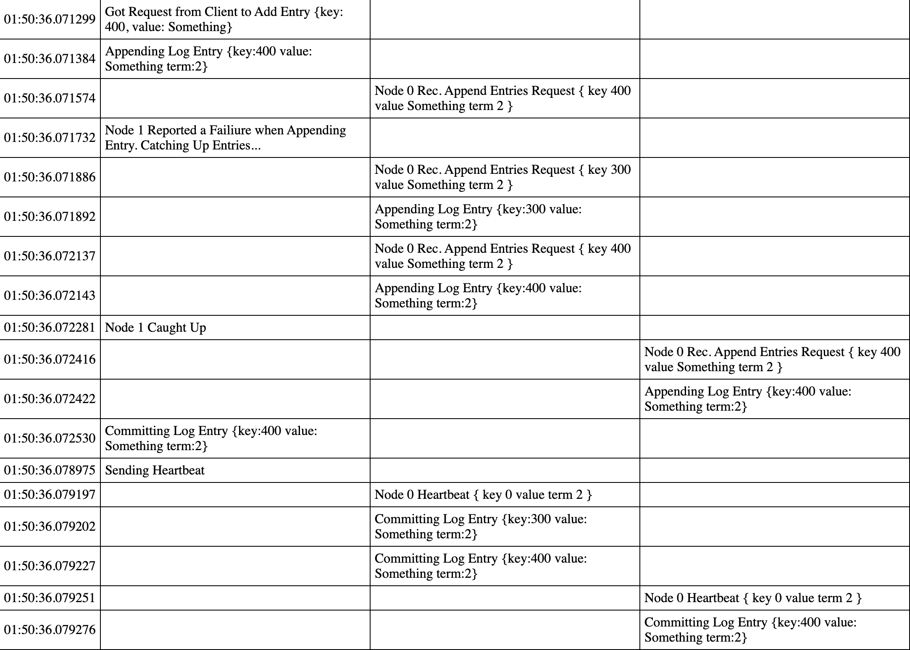

# buoy

A simple implementation of a consistent, distributed Key:Value store which uses the [Raft Concensus Algorithm](https://raft.github.io/raft.pdf).

This project launches a cluster of raft nodes that run as concurrent state machines.
A client interface is also provided for finding the leader and sending data to the cluster.
Each node is equipped with gRPC clients/servers for communication with the client interface and other nodes.

The cluster is tolerant to node failiures and network partitions (a cluster of N can support ⌈N/2⌉ - 1 failures).
The cluster is smart enough to elect a new leader if needed, and the client is smart enough to find the leader.  

## Interesting Events

This project offers a debug flag which creates a `log.html` file that contains a table of cluster events.
The log used to generate the report below is included as `log-heartbeats-purged.html`. It contains the data for
all the interesting events below, but 8000+ lines of heartbeat events have been manually removed to keep the file short.

### 1. Initial Leader Election 

All the nodes start as followers without any data. 
Node 1's randomized election timer runs out first, so it increments its term starts an election. Nodes 0 and 2
grant their votes to node 1, and node 1 votes for itself.
Now, all nodes are in term 1 with node 1 as the leader. 

### 2. Heartbeats

As the leader, node 1 has the duty to to indicate that there is a leader in the cluster. It sends empty, idempotent
requests to append data to each node in the cluster to indicate that it is functional. No more elections start because
each follower node resets its election timer upon receiving these heartbeats. 

### 3. Updating Data in the Cluster

Node 1, the leader, receives data `{key: 100, value: "Some Value"}` from the client.
It tells nodes 1 and 2 to append that change to their logs. Because both succeed, node 0 knows the entry is
successfully duplicated on the majority of servers, so it commits the log entry. 

In the following heartbeat, the node 1 tells its followers that it has committed upto the last entry, so the
nodes 0 and 2 commit their log entries locally. 

### 4. Follower Node Failure  

Node 0 dies and does not recieve heartbeats from node 1. 

Node 1 gets a request to add a value `{key: 200}`. Although it cannot send it to node 0, it successfully
sends the entry to node 2. It commits it knowing that is
duplicated on the majority of nodes. 

Node 0 comes back to life and starts receiving heartbeats again.

Node 1 gets a request to add another value `{key: 300}`. When sending it to node 0, it sees that node 0
missed the previous value `{key: 200}` while it was dead. Node 1 catches up node 0 by giving it log entries
to append. On the following heartbeat, all the nodes see that the leader has committed up to commit up to `{key: 300}`, so they commit any missed log entries up to and including the entry with `{key: 300}`.

### 5. Leader Node Failure and Re-Election

Here, the leader node dies. Node 2 starts an election for itself. Node 2 fails to get elected as leader.
Most likely, this is because node 0 started an election at roughly the same time and voted for itself.
Node starts and election and succeeds, getting a vote from node 2 and itself.

As the new leader, node 0 gets a new entry, modifying `{key:200}`. As the leader, it duplicates the entry onto node 2 and
commits it. Node 2 commits it after the following heartbeat.

Node 1 comes back online and starts getting heartbeats again.

Node 0 gets the request to add an entry to modify `{key:300}`. When sending it to node 1, it sees that node 1 is out of
date, so it catches up node 1. Node 1 appends the entry it missed `{key:200}` and the new entry `{key:300}` to
its log. Node 2 appends the new entry to its log. Node 0 commits its newest entry, knowing that it was
duplicated on the majority of servers (all of them in this case). During the next heartbeat, nodes 1 and 2
see that the leader has committed up to its newest entry `{key:300}`, so they commit all uncommitted entries up to that. 

## Resources
- A practical [guide](https://eli.thegreenplace.net/2020/implementing-raft-part-0-introduction/) to implementing Raft.  
- [The Raft paper](https://raft.github.io/raft.pdf)

## Usage

The configuration.yml file defines the networking configs needed to run the simulation.

To launch the cluster with html log: 
`go build && ./buoy -debug`

To launch the client with: 
`go build && ./buoy -client`

Client Commands: 
1. `{key}={value}` Set int32 key to string value
2. `kill {nodeId}` Kill a node with a given id (must be a node id from the config file)
3. `revive {nodeId}` Restore a dead node to the follower state

## Development  
Download Deps
`go mod download`  

Generate Protocol Buffer for node <-> node RPCs
`protoc -I node/ node/raft.proto --go_out=plugins=grpc:node`

Generate Protocol Buffer for client <-> cluster RPCs
`protoc -I api/ api/api.proto --go_out=plugins=grpc:api`

Formatting  
`go fmt ./...`
